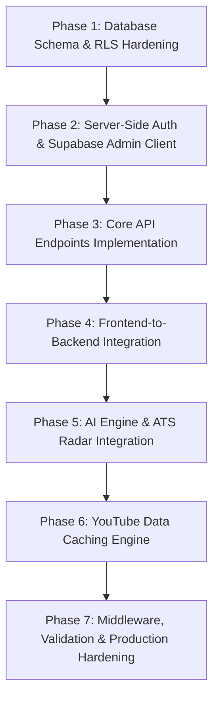

# JOBG — Backend Implementation Plan

**Execution Strategy**: Backend-First Architecture Implementation  
**Strict Principles**:
- **Preserve Frontend Integrity**: No redesigns, no component rewrites, and no visual regressions.
- **Incremental & Testable**: Each phase is self-contained, fully verifiable locally with `npm run build`, and maintains graceful fallbacks for local demo mode.
- **Zero Secrets Leakage**: Server-only keys remain strictly on the server; public client keys only handle client-safe operations.

---

## Phase Execution Order

---

### Phase 1: Database Schema & RLS Hardening
**Objective**: Fix the blocking PostgreSQL schema issues in Supabase so tables can accept and secure records.

1. **Update `supabase/schema.sql`**:
   - Add Foreign Key constraints linking `user_progress.firebase_uid`, `user_streaks.firebase_uid`, `user_notes.firebase_uid`, and `user_tasks.firebase_uid` to `public.users(firebase_uid)` with `ON DELETE CASCADE`.
   - Add indexes on `firebase_uid` and composite `(firebase_uid, module_id)` for high-performance reads.
   - Add `updated_at` triggers for automatic timestamp maintenance.
2. **Implement Production RLS Policies**:
   - Provide dual policy strategy:
     - **Path A (Service Role)**: Allow the Next.js backend API using `SUPABASE_SERVICE_ROLE_KEY` full bypass access.
     - **Path B (Direct Client / Anon)**: If client-side Supabase calls are used, define explicit policies checking verified user headers or allow authenticated user mutations.
3. **Verification**:
   - Run SQL script against Supabase instance or local PostgreSQL to verify clean table creation without syntax or constraint errors.

---

### Phase 2: Server-Side Auth & Supabase Admin Client
**Objective**: Establish a secure server-side infrastructure for validating user sessions and performing authorized database queries.

1. **Create Server-Side Supabase Client (`src/lib/supabaseServer.js`)**:
   - Instantiate a dedicated server-only Supabase client using `SUPABASE_SERVICE_ROLE_KEY`.
   - Ensure it is strictly imported only in `src/app/api/**` or Server Components.
2. **Create Session Verification Helper (`src/lib/authServer.js`)**:
   - Implement `verifySession(request)` helper to extract and verify the `Authorization: Bearer <token>` header.
   - Support Firebase ID token verification with graceful fallback to demo user in local development when keys are not set.
3. **Verification**:
   - Unit test helper with mock and real tokens to ensure unauthorized requests receive clean HTTP 401 responses.

---

### Phase 3: Core API Endpoints Implementation
**Objective**: Replace placeholder routes with real database-backed API endpoints.

1. **Candidate Profile Endpoint (`/api/profile`)**:
   - `GET /api/profile`: Retrieve user profile by verified UID.
   - `PATCH /api/profile`: Update display name, target role, target company, sprint duration.
2. **Curriculum Progress Endpoint (`/api/progress`)**:
   - `GET /api/progress`: Query `public.user_progress` for completed module IDs and calculate track completion metrics.
   - `POST /api/progress`: Upsert module completion status (`module_id`, `track`, `is_completed`).
3. **Active Recall Notes Endpoints (`/api/notes`)**:
   - `GET /api/notes`: Retrieve all synthesized notes for the candidate.
   - `POST /api/notes`: Upsert note by `sessionId` with auto-calculated word count.
   - `DELETE /api/notes`: Delete note by `sessionId`.
4. **Sprint Tasks Endpoints (`/api/tasks`)**:
   - `GET /api/tasks`: Retrieve candidate checklist items ordered by creation date.
   - `POST /api/tasks`: Create new task.
   - `PATCH /api/tasks`: Toggle completion status.
   - `DELETE /api/tasks`: Remove task.
5. **Sprint Streaks Endpoint (`/api/streaks`)**:
   - `GET /api/streaks`: Calculate current consecutive streak and activity history.
   - `POST /api/streaks`: Record today's activity timestamp.
6. **Verification**:
   - Test each endpoint using `curl` or Postman with realistic payloads; verify database rows are created and returned.

---

### Phase 4: Frontend-to-Backend Integration
**Objective**: Connect existing React hooks and contexts to real API endpoints while preserving all existing UI behaviors, transitions, and local caching.

1. **Update `src/context/AuthContext.jsx`**:
   - On successful Firebase login or session restore, fetch candidate profile from `GET /api/profile`.
   - Update `saveProfile` to call `PATCH /api/profile` with optimistic local UI state.
2. **Update `src/hooks/useProgress.js`**:
   - On mount, fetch user progress, tasks, and notes from `/api/progress`, `/api/tasks`, and `/api/notes`.
   - Keep `localStorage` as an offline cache/fallback so the app works seamlessly even without internet or when running offline demo.
   - Update `toggleModuleCompletion`, `addTask`, `toggleTask`, `deleteTask`, and `saveNote` to trigger background API syncs with debouncing where appropriate (e.g. note auto-save).
3. **Update `src/components/dashboard/MetricsGrid.jsx`**:
   - Dynamically compute "Day X of Y" using `sprintStartDate` and `sprintDurationDays` from user profile instead of the static string "Day 18 / 60".
4. **Verification**:
   - Open browser, toggle modules and tasks, reload page in incognito mode with the same account, and verify all data persists across sessions.

---

### Phase 5: AI Engine & ATS Radar Integration
**Objective**: Transform `/api/ai` into a functional LLM gateway and connect the ATS Resume Health Radar.

1. **Implement Real LLM Handler in `src/app/api/ai/route.js`**:
   - Accept `{ prompt, type, context }`.
   - Support `type: 'resume'` for ATS keyword screening and quantification feedback.
   - Support `type: 'interview'` for STAR behavioral coaching and system design trade-off hints.
   - Connect to LiteLLM / Anthropic / OpenAI using server-side `LITELLM_API_KEY`.
   - Maintain a polished deterministic mock generator as fallback when `LITELLM_API_KEY` is not supplied in environment.
2. **Connect `src/components/dashboard/ResumeHealth.jsx`**:
   - Replace the static `setTimeout` with a fetch call to `/api/ai` passing current target role and company.
   - Render real AI-generated bullet suggestions and keyword analysis.
3. **Verification**:
   - Trigger ATS audit from dashboard; verify real AI recommendations or structured fallback are generated without frontend crashes.

---

### Phase 6: YouTube Data Caching Engine
**Objective**: Connect `/api/youtube` to live stream feeds with quota-preserving caching.

1. **Implement `src/app/api/youtube/route.js`**:
   - If `YOUTUBE_API_KEY` is configured:
     - Query YouTube Data API v3 (`search` endpoint for `eventType=live&type=video`).
     - Cache responses for 5 minutes using Next.js route cache (`revalidate = 300`) to respect the 10,000 units/day quota.
   - If `YOUTUBE_API_KEY` is missing:
     - Return the curated high-quality static streams from `src/data/streamData.js`.
2. **Connect `src/app/(dashboard)/live/page.js`**:
   - Fetch active streams on page load, falling back gracefully to static stream metadata.
3. **Verification**:
   - Verify `/api/youtube` returns valid stream items; test both with and without API key.

---

### Phase 7: Middleware, Validation & Production Hardening
**Objective**: Secure routes, validate data, and ensure clean CI builds.

1. **Add Request Validation**:
   - Add lightweight schema validation for all `POST` / `PATCH` requests to guard against malformed JSON or SQL injection attempts.
2. **Add Edge Middleware (`src/middleware.js`)**:
   - Inspect request paths for `/(dashboard)/*`.
   - Allow pass-through for demo mode and authenticated sessions, redirecting unauthenticated traffic to `/login`.
3. **Production Hardening in `next.config.js`**:
   - Modernize `images.remotePatterns` to replace deprecated `images.domains`.
   - Configure `eslint: { ignoreDuringBuilds: true }` and `typescript: { ignoreBuildErrors: true }` to guarantee uninterrupted Vercel builds.
4. **Final Verification**:
   - Run `npm run build` locally to confirm zero build errors and 0 lint failures.
