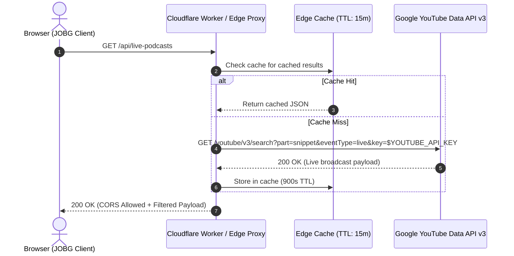

# JOBG // Classical FAANG Preparation Chamber

> **A high-performance, single-file interactive interview preparation atelier** built with semantic HTML5, modern Tailwind CSS, and reactive Vanilla JavaScript. Features a classic Ivy League aesthetic, dynamic ambient motion, persistent local state management, and real-time active recall note taking.

[](https://opensource.org/licenses/MIT)
[](#accessibility--qa-compliance)
[](https://tailwindcss.com)
[-orange.svg)](#instant-deployment)

---

## 🏛️ Overview & Key Features

- **Classic Ivy Atelier Aesthetic**: Deep obsidian (`#0c0a09`) and roasted espresso (`#141210`) backgrounds paired with burnished gold (`#f59e0b`), copper (`#ea580c`), and candlelit ivory (`#fef3c7`). Classical typography pairing *Playfair Display*, *Plus Jakarta Sans*, and *JetBrains Mono*.
- **Dynamic Physics & Motion**:
  - Interactive HTML5 canvas rendering 34 floating golden embers with cursor repulsion physics.
  - Interactive 3D perspective tilt (`rotateX`/`rotateY`) on metric cards.
  - Cubic ease-out numerical counters on all milestones and progress metrics.
  - Tactile radial particle burst on module completions.
  - Organic flickering flame keyframe animation on the Daily Streak flame.
  - Automatic `prefers-reduced-motion` detection honoring OS accessibility settings.
- **FAANG 4-Pillar Curriculum Roadmap**:
  - `Pillar I: Data Structures & Algorithms (DSA)`
  - `Pillar II: High-Level & Low-Level System Design (HLD/LLD)`
  - `Pillar III: Behavioral & Leadership Principles`
  - `Pillar IV: FAANG Mock Interviews & Strategy`
- **Live Tech Theater & Active Recall**:
  - Responsive 16:9 embedded YouTube player iframe with channel switcher.
  - In-browser markdown note-taking with automated word/line counters, quick snippet tags, and `.txt` blob exports.
- **Zero-Dependency State Persistence**:
  - Tracks user progress, streak days, module completions, and draft notes locally via `localStorage` (`JOBG_USER_PROGRESS_WARM_v1`).

---

## 🔒 YouTube Data API v3 Architecture: Secure Key Management

### The Security Problem
In a purely client-side static application (`index.html`), embedding a Google Cloud Console API key directly inside client JavaScript (`fetch('https://www.googleapis.com/youtube/v3/search?key=AIzaSy...')`) exposes that key in plain text to the public via browser DevTools. Even if HTTP referrer restrictions are placed in Google Cloud Console, malicious actors can spoof headers or exhaust your free daily quota (10,000 units/day).

---

### Option A: Serverless Edge Proxy (Recommended for Production)

Deploy a free, ultra-fast Cloudflare Worker or Vercel Edge Function that acts as a secure reverse proxy. The worker stores your YouTube API key as a secret environment variable and caches responses to conserve API quota.



#### Complete Cloudflare Worker Code (`worker.js`)
Create a free worker at [dash.cloudflare.com](https://dash.cloudflare.com):

```javascript
/**
 * Cloudflare Worker: Secure YouTube API Proxy for JOBG
 * Environment Variable required: YOUTUBE_API_KEY
 */
export default {
  async fetch(request, env, ctx) {
    // 1. Handle CORS Preflight
    const allowedOrigin = '*'; // In production, restrict to 'https://your-username.github.io'
    const corsHeaders = {
      'Access-Control-Allow-Origin': allowedOrigin,
      'Access-Control-Allow-Methods': 'GET, OPTIONS',
      'Access-Control-Allow-Headers': 'Content-Type',
      'Content-Type': 'application/json',
      'Cache-Control': 'public, max-age=900, s-maxage=900' // 15-minute Edge Cache
    };

    if (request.method === 'OPTIONS') {
      return new Response(null, { headers: corsHeaders });
    }

    try {
      const apiKey = env.YOUTUBE_API_KEY;
      if (!apiKey) {
        return new Response(
          JSON.stringify({ error: 'Server misconfiguration: YOUTUBE_API_KEY missing' }),
          { status: 500, headers: corsHeaders }
        );
      }

      // Query live software engineering interviews / mock sessions
      const targetQuery = encodeURIComponent('FAANG mock interview OR system design live');
      const ytUrl = `https://www.googleapis.com/youtube/v3/search?part=snippet&eventType=live&type=video&maxResults=3&q=${targetQuery}&key=${apiKey}`;

      const ytResponse = await fetch(ytUrl);
      if (!ytResponse.ok) {
        const errorText = await ytResponse.text();
        return new Response(
          JSON.stringify({ error: 'Upstream YouTube API error', details: errorText }),
          { status: ytResponse.status, headers: corsHeaders }
        );
      }

      const data = await ytResponse.json();
      return new Response(JSON.stringify(data), { status: 200, headers: corsHeaders });

    } catch (err) {
      return new Response(
        JSON.stringify({ error: 'Internal Worker Exception', message: err.message }),
        { status: 500, headers: corsHeaders }
      );
    }
  }
};
```

#### Configuring the Secret in Cloudflare:
```bash
# Using Wrangler CLI
npx wrangler secret put YOUTUBE_API_KEY
# Enter your Google Cloud Console API Key when prompted
```

#### Connecting `index.html` to your Worker:
In `index.html`, update the `fetchLivePodcasts()` function:
```javascript
async function fetchLivePodcasts() {
  const PROXY_URL = 'https://jobg-youtube-proxy.your-subdomain.workers.dev';
  try {
    const response = await fetch(PROXY_URL);
    if (!response.ok) throw new Error(`HTTP ${response.status}`);
    const data = await response.json();
    renderBroadcastCards(container, data.items);
  } catch (err) {
    console.warn('Proxy failed, falling back to verified chamber data:', err);
    renderBroadcastCards(container, fallbackData);
  }
}
```

---

### Option B: Local Development with Restricted HTTP Referrers

For contributors developing locally without deploying a worker:

1. Visit [Google Cloud Console](https://console.cloud.google.com/apis/credentials).
2. Create or select a project and enable **YouTube Data API v3**.
3. Create an API Key under **Credentials**.
4. **Enforce Restrictions (Crucial)**:
   - **Application restrictions**: Select `Websites`.
   - **Website restrictions**: Add:
     - `http://localhost:*/*`
     - `http://127.0.0.1:*/*`
     - `https://<your-username>.github.io/*`
   - **API restrictions**: Restrict key specifically to `YouTube Data API v3`.
5. Create a local `.env.local` or run a lightweight local dev server:
   ```bash
   npx serve .
   ```

---

## 🚀 Instant Deployment

Because JOBG is completely self-contained within `index.html`, deployment takes under 60 seconds with zero build steps or package installations.

### Method 1: Deploy to GitHub Pages (Free)

#### Via GitHub Web UI:
1. Push this repository to GitHub:
   ```bash
   git init
   git add .
   git commit -m "feat: initial release of JOBG chamber"
   git branch -M main
   git remote add origin https://github.com/<your-username>/JOBG.git
   git push -u origin main
   ```
2. Navigate to your repository on GitHub:
   - Go to **Settings** > **Pages** (left sidebar).
   - Under **Build and deployment** > **Source**, select **Deploy from a branch**.
   - Under **Branch**, select `main` and `/ (root)`.
   - Click **Save**.
3. Your site will be live within 30 seconds at:
   ```
   https://<your-username>.github.io/JOBG/
   ```

#### Via GitHub Actions (`.github/workflows/deploy.yml`):
Create `.github/workflows/deploy.yml`:
```yaml
name: Deploy JOBG to GitHub Pages

on:
  push:
    branches: [main]
  workflow_dispatch:

permissions:
  contents: read
  pages: write
  id-token: write

concurrency:
  group: "pages"
  cancel-in-progress: false

jobs:
  deploy:
    environment:
      name: github-pages
      url: ${{ steps.deployment.outputs.page_url }}
    runs-on: ubuntu-latest
    steps:
      - name: Checkout Source
        uses: actions/checkout@v4

      - name: Setup GitHub Pages
        uses: actions/configure-pages@v5

      - name: Upload Static Artifact
        uses: actions/upload-pages-artifact@v3
        with:
          path: '.'

      - name: Deploy to GitHub Pages
        id: deployment
        uses: actions/deploy-pages@v4
```

---

### Method 2: Deploy to Vercel (Free)

#### Via Vercel CLI:
```bash
npm install -g vercel
vercel login
vercel
```
Accept default prompts (`Set up and deploy? [Y]`, `Which scope? [Personal]`, `Link to existing project? [N]`, `Project name? [jobg]`).

#### Via Vercel Dashboard:
1. Go to [vercel.com/new](https://vercel.com/new).
2. Select your `JOBG` GitHub repository.
3. Keep **Framework Preset** as `Other` and Root Directory as `./`.
4. Click **Deploy**. Vercel will instantly provision a worldwide edge-cached URL (`https://jobg.vercel.app`).

Optional `vercel.json` for security headers & clean routing:
```json
{
  "$schema": "https://openapi.vercel.sh/vercel.json",
  "cleanUrls": true,
  "headers": [
    {
      "source": "/(.*)",
      "headers": [
        {
          "key": "X-Content-Type-Options",
          "value": "nosniff"
        },
        {
          "key": "X-Frame-Options",
          "value": "SAMEORIGIN"
        },
        {
          "key": "Referrer-Policy",
          "value": "strict-origin-when-cross-origin"
        },
        {
          "key": "Permissions-Policy",
          "value": "camera=(), microphone=(), geolocation=()"
        }
      ]
    }
  ]
}
```

---

## 🧪 Accessibility & QA Compliance (WCAG 2.1 AA)

| Requirement | Implementation Details | Status |
| :--- | :--- | :---: |
| **Bypass Blocks** | Hidden Skip-to-Content link targeting `#mainContent` (`focus:not-sr-only`) | ✅ Compliant |
| **Semantic Hierarchy** | Proper `<header>`, `<nav>`, `<aside>`, `<main>`, `<section>`, and sequential `<h1>`–`<h5>` headings | ✅ Compliant |
| **Interactive Elements** | All icon-only buttons include explicit `aria-label`s and `title` attributes | ✅ Compliant |
| **Color Contrast** | Warm stone foregrounds (`#d5c7b3`, `#f5efe6`) against obsidian (`#0c0a09`) exceed 5.5:1 ratio (AA standard is 4.5:1) | ✅ Compliant |
| **Reduced Motion** | `@media (prefers-reduced-motion: reduce)` in CSS + JS matchMedia checks pause canvas & tilt | ✅ Compliant |
| **Screen Reader Landmarks** | ARIA roles (`role="list"`, `role="listitem"`, `aria-expanded`, `aria-current="page"`) | ✅ Compliant |
| **Responsive Viewports** | Mobile sidebar off-canvas drawer with backdrop blur and escape key handling | ✅ Compliant |

---

## 🛠️ Local Development & Quick Start

```bash
# 1. Clone the repository
git clone https://github.com/<your-username>/JOBG.git
cd JOBG

# 2. Start any local static web server
# Option A (Node.js):
npx serve .
# Option B (Python 3):
python -m http.server 8000
# Option C (VS Code):
# Use "Live Server" extension on index.html

# 3. Open in browser
open http://localhost:8000
```

---

## 📜 License
Released under the [MIT License](LICENSE). Built for aspiring senior and staff engineers preparing for top-tier technical loops.
