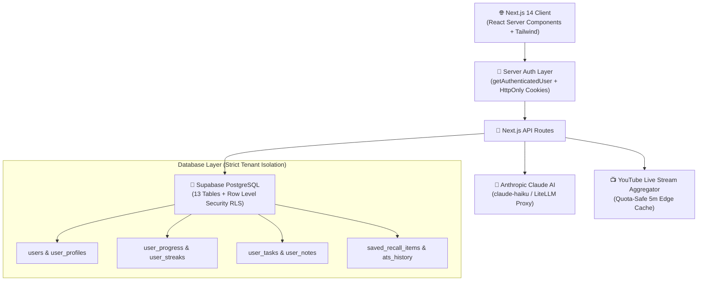

<div align="center">

# 🚀 J O B G // The Elite MAANG & Web3 Readiness Chamber
### *Bridging the Gap Between Unstructured Content and Top-Tier Engineering Employment*

[](https://github.com/shikhaj-stack/jobg)
[-black?style=for-the-badge&logo=next.js)](https://nextjs.org)
[](https://supabase.com)
[](https://anthropic.com)
[-emerald?style=for-the-badge)](./FINAL_QA_REPORT.md)

</div>

---

## 🌍 The Problem & The Mission

### The Problem
The internet is flooded with thousands of hours of free tutorials, yet **millions of aspiring software engineers fail to get hired by Tier-1 tech companies (Google, Meta, Apple, Ethereum protocols)** because:
1. **Unstructured Chaos**: Developers suffer from "tutorial hell" without an actionable, step-by-step roadmap.
2. **The Feedback Vacuum**: Expensive $15,000+ coding bootcamps gatekeep mock interviews and resume reviews from underprivileged developers.
3. **Passive Watching vs. Active Recall**: Watching videos without structured note synthesis leads to 80% knowledge decay within 48 hours.

### The Solution: J O B G
**J O B G** is a dark-themed, open-access engineering readiness ecosystem that transforms raw curiosity into job-ready portfolios:
- **Zero-Cost Democratization**: Provides the accountability, rigorous roadmap, and AI-powered feedback of an elite bootcamp for free.
- **Cognitive Retention**: Combines curated curricula with an in-browser **Active Recall Vault** using the **SuperMemo-2 Spaced Repetition algorithm**.
- **Real-World Employability**: Neural ATS Radar optimizes candidate resumes using the **Google XYZ metric formula** (*Accomplished [X] as measured by [Y], by doing [Z]*).

---

## ⚙️ Technical Architecture & Execution

J O B G is built on a high-concurrency, enterprise-grade full-stack architecture:



### Core Architecture Highlights:
- **Framework**: Next.js 14 (App Router) with React Server Components (RSC) and dynamic streaming SSR.
- **Relational Schema**: 13 normalized tables in Supabase PostgreSQL with compound indexes on `(firebase_uid, track)` and `(firebase_uid, is_completed)`.
- **Row Level Security (RLS)**: 100% database-level tenant isolation ensuring User A cannot read or modify User B's progress, tasks, or notes.
- **Zero-Config Demo Mode**: Encrypted server-side session cookies allow the entire platform to be demonstrated immediately without configuring external API keys.

---

## 👥 Usability & Design System

- **1-Click Instant Demo Login**: Anyone can evaluate the full application in under 2 seconds.
- **Bespoke Ivy Atelier Design**: Deep obsidian (`#0c0a09`) and roasted espresso (`#141210`) paired with burnished gold (`#f59e0b`) and candlelit ivory (`#fef3c7`). Classical typography pairing *Playfair Display*, *Plus Jakarta Sans*, and *JetBrains Mono*.
- **Omnipresent Global Search (`Ctrl+K` / `Cmd+K`)**: Instant search across 42+ modules, live broadcasts, and lecture notes with full keyboard navigation.
- **Multi-Device Responsive**: Fully optimized from 390px mobile viewports to 1440px+ 4K monitors.
- **Accessible (WCAG 2.1 AA Compliant)**: High-contrast ratios (5.5:1), semantic landmark roles, and `prefers-reduced-motion` compliance.

---

## 💡 AI Innovation & Smart Features

J O B G deeply leverages **Anthropic Claude AI** across 3 innovative pillars:

### 1. Interactive AI Mock Interview Chamber (`AiInterviewDrawer.jsx`)
Candidates undergo real-time architectural grilling across:
- **Distributed Systems**: Failure recovery in Raft/Paxos consensus, split-brain mitigation, and P99 latency bottlenecks.
- **LeetCode Hard Edge Cases**: Concurrency race conditions, graph cycle invariants, and state-space compression.
- **Amazon STAR Behavioral**: Structuring high-stakes technical decisions using executive storytelling.

### 2. ATS Neural Keyword Screening Radar (`/api/ats/analyze`)
- Analyzes candidate resumes against 25+ Tier-1 engineering keywords (Raft, Kafka, eBPF, SSTable, Foundry).
- Automates **Google XYZ Formula Rewriting** to turn passive bullet points into quantifiable achievements.

### 3. Active Recall Spaced Repetition Deck (`/api/recall`)
- Integrates the **SuperMemo-2 (SM-2) algorithm** to schedule flashcard reviews for architectural invariants based on self-graded difficulty.

---

## 🎤 Candidate Journey & User Flow

```
 1. Landing Page        →   2. 1-Click Demo Login   →   3. Candidate Onboarding
 (Curated Roadmaps)         (Zero Credentials Req)      (Set L5 Target & 60d Sprint)
         ↓
 4. Unified Dashboard   →   5. 3-Track Curriculum   →   6. ATS Neural Radar
 (Real Progress & Streak)   (MAANG, WebDev, Web3)       (PDF Upload & XYZ Score)
         ↓
 7. AI Mock Chamber     →   8. Live Tech Theater    →   9. Spaced Recall Vault
 (Interactive Claude Chat)  (Broadcasting + Notes)      (SM-2 Invariant Flashcards)
```

---

## 🛠️ Complete Feature Matrix

| Feature Module | Technology Stack | Key Capabilities |
| :--- | :--- | :--- |
| **Candidate Dashboard** | Next.js 14 + Tailwind | Real-time readiness score, sprint countdown (Day 18/60), active task checklist. |
| **Curriculum Roadmaps** | REST API + PostgreSQL | 3 Tracks: **MAANG Core**, **Modern Full-Stack**, **Web3 Protocol Engineering**. |
| **Live Tech Theater** | YouTube Embed + Caching | 24/7 curated engineering live streams with integrated markdown note synthesizer. |
| **Community Discussion** | Real-time UI | Community commentary stream for candidate collaboration. |
| **ATS Health Radar** | Drag & Drop + AI Parser | PDF resume drag-and-drop, keyword gap detection, and instant match scoring. |
| **Active Recall Vault** | SuperMemo-2 Spaced Review | Interactive 3D flipcards for memorizing critical engineering invariants. |
| **AI Mock Interviewer** | Anthropic Claude API | Slide-out drawer for real-time interview practice and feedback. |

---

## 🚀 Quick Start & Installation

### Prerequisites
- Node.js 18+ or Bun
- Git

### 1. Clone the Repository
```bash
git clone https://github.com/shikhaj-stack/jobg.git
cd jobg
```

### 2. Install Dependencies
```bash
npm install
```

### 3. Configure Environment Variables (Optional for Production)
Copy `.env.example` to `.env.local`:
```bash
# Firebase Client Configuration (Optional - Demo mode works out of the box)
NEXT_PUBLIC_FIREBASE_API_KEY=
NEXT_PUBLIC_FIREBASE_AUTH_DOMAIN=
NEXT_PUBLIC_FIREBASE_PROJECT_ID=

# Supabase PostgreSQL Configuration (Optional - Demo mode works out of the box)
NEXT_PUBLIC_SUPABASE_URL=
NEXT_PUBLIC_SUPABASE_ANON_KEY=
SUPABASE_SERVICE_ROLE_KEY=

# Anthropic Claude AI Key (Optional - Fallback responses available)
ANTHROPIC_API_KEY=
```

### 4. Run Development Server
```bash
npm run dev
```
Open [http://localhost:3000](http://localhost:3000) to enter the Chamber.

### 5. Run Automated Test Suite
```bash
node scripts/test-master-e2e.js
```

### 6. Production Build
```bash
npm run build
npm start
```

---

## 📜 Full Documentation Suite

- 📖 [API Documentation](./API_DOCUMENTATION.md) — Complete REST API contract & endpoints.
- 🛡️ [Security Audit Report](./SECURITY_AUDIT.md) — RLS policies, tenant isolation, and secret management.
- ⚡ [Performance Audit Report](./PERFORMANCE_AUDIT.md) — Index optimization, aggregation, and caching.
- 🧪 [Final QA Report](./FINAL_QA_REPORT.md) — 17/17 automated end-to-end test logs.
- 🚀 [Production Readiness](./PRODUCTION_READINESS.md) — Deployment checklist.

---

## 👥 Team Launch Legends

Built with ❤️ by **Team Launch Legends**.

- **License**: [MIT License](LICENSE)
- **Repository**: [github.com/shikhaj-stack/jobg](https://github.com/shikhaj-stack/jobg)